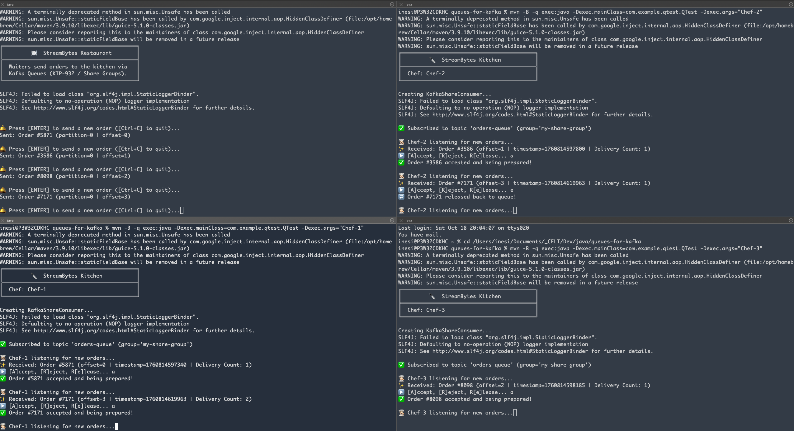

# Queues for Kafka Demo

This is a minimal demo of **Queues for Kafka** (KIP-932), showing how Apache Kafka® can be used in a queue-like fashion where messages are delivered to only one consumer within a shared group. The demo simulates a restaurant scenario:
 - waiters (producers) send orders to the kitchen (Kafka topic `orders-queue`), and
 - multiple chefs (consumers in the same share group) pick up and process orders one by one.  

The demo is based on the following resources:  
- [KIP-932: Queues for Kafka](https://cwiki.apache.org/confluence/display/KAFKA/KIP-932%3A+Queues+for+Kafka)  
- [Morling Dev: KIP-932 Queues for Kafka](https://www.morling.dev/blog/kip-932-queues-for-kafka/)

---

## Dependencies

- [Maven](https://maven.apache.org/install.html)  
- [Java 17](https://www.oracle.com/java/technologies/javase/jdk17-archive-downloads.html)  
- [Docker](https://docs.docker.com/get-docker/)

---

## Setup and Configure Apache Kafka 4.1.0

### Compile the project:
```bash
mvn compile
```

Output example:
```bash
WARNING: A terminally deprecated method in sun.misc.Unsafe has been called
WARNING: sun.misc.Unsafe::staticFieldBase has been called by com.google.inject.internal.aop.HiddenClassDefiner (file:/opt/homebrew/Cellar/maven/3.9.10/libexec/lib/guice-5.1.0-classes.jar)
WARNING: Please consider reporting this to the maintainers of class com.google.inject.internal.aop.HiddenClassDefiner
WARNING: sun.misc.Unsafe::staticFieldBase will be removed in a future release
[INFO] Scanning for projects...
[INFO] 
[INFO] -------------------------< com.example:qtest >--------------------------
[INFO] Building qtest 1.0-SNAPSHOT
[INFO]   from pom.xml
[INFO] --------------------------------[ jar ]---------------------------------
[INFO] 
[INFO] --- resources:3.3.1:resources (default-resources) @ qtest ---
[WARNING] Using platform encoding (UTF-8 actually) to copy filtered resources, i.e. build is platform dependent!
[INFO] skip non existing resourceDirectory /Users/inesi/Documents/_CFLT/Dev/java/queues-for-kafka/src/main/resources
[INFO] 
[INFO] --- compiler:3.13.0:compile (default-compile) @ qtest ---
[INFO] Recompiling the module because of added or removed source files.
[WARNING] File encoding has not been set, using platform encoding UTF-8, i.e. build is platform dependent!
[INFO] Compiling 3 source files with javac [debug target 17] to target/classes
[WARNING] location of system modules is not set in conjunction with -source 17
  not setting the location of system modules may lead to class files that cannot run on JDK 17
    --release 17 is recommended instead of -source 17 -target 17 because it sets the location of system modules automatically
[INFO] ------------------------------------------------------------------------
[INFO] BUILD SUCCESS
[INFO] ------------------------------------------------------------------------
[INFO] Total time:  0.711 s
[INFO] Finished at: 2025-10-18T20:04:20+01:00
[INFO] ------------------------------------------------------------------------
```

### Pull the Kafka 4.1.0 Docker image:
```bash
docker pull apache/kafka:4.1.0
```

Output example:
```bash
4.1.0: Pulling from apache/kafka
6e174226ea69: Already exists 
65b71ebe70c7: Pull complete 
ffd236ccc425: Pull complete 
4789cfd3eee8: Pull complete 
98e6dc79a227: Pull complete 
cd61f5351b3e: Pull complete 
f750e0a0984e: Pull complete 
6b1f833ff78d: Pull complete 
24d8c1f280e9: Pull complete 
c6c27b7944e0: Pull complete 
700688e2c13a: Pull complete 
Digest: sha256:bff074a5d0051dbc0bbbcd25b045bb1fe84833ec0d3c7c965d1797dd289ec88f
Status: Downloaded newer image for apache/kafka:4.1.0
docker.io/apache/kafka:4.1.0

What's next:
    View a summary of image vulnerabilities and recommendations → docker scout quickview apache/kafka:4.1.0
```

## Running the Demo

### Start Kafka Broker

#### On one terminal, run:
```bash
docker run --rm -p 9092:9092 apache/kafka:4.1.0
```

#### Inside the container, execute the following to enable share groups and create the topic:
```bash
opt/kafka/bin/kafka-features.sh --bootstrap-server localhost:9092 upgrade --feature share.version=1
opt/kafka/bin/kafka-topics.sh --bootstrap-server localhost:9092 --create --topic orders-queue
opt/kafka/bin/kafka-topics.sh --bootstrap-server localhost:9092 --list
```

Note the topic `orders-queue` was created with oen partion only!

Output example:
```bash
share.version was upgraded to 1.
Created topic orders-queue.
orders-queue
```

## Run the Producer

### On another terminal, run:
```bash
mvn -B -q exec:java -Dexec.mainClass=com.example.qtest.QProducer
```

Output example:
```bash
╔═══════════════════════════════════════════╗
║         🍽️  StreamBytes Restaurant        ║
╠═══════════════════════════════════════════╣
║  Waiters send orders to the kitchen via   ║
║  Kafka Queues (KIP-932 / Share Groups).   ║
╚═══════════════════════════════════════════╝

🛎️ Press [ENTER] to send a new order ([Ctrl+C] to quit)...
```

## Run the Share Consumers (Chefs)

### Open three separate terminals (one for each chef) and run:
```bash
mvn -B -q exec:java -Dexec.mainClass=com.example.qtest.QTest -Dexec.args="Chef-1"
mvn -B -q exec:java -Dexec.mainClass=com.example.qtest.QTest -Dexec.args="Chef-2"
mvn -B -q exec:java -Dexec.mainClass=com.example.qtest.QTest -Dexec.args="Chef-3"
```

Each chef will receive orders in a queue-style delivery, and you can choose to Accept (A), Release (E), or Reject (R) each order.

Output example for `Chef-1`:
```bash
╔═══════════════════════════════════════════╗
║         🔪  StreamBytes Kitchen           ║
╠═══════════════════════════════════════════╣
║  Chef: Chef-1                             ║
╚═══════════════════════════════════════════╝

Creating KafkaShareConsumer...

✅ Subscribed to topic 'orders-queue' (group='chefs-share-group')

👨🏻‍🍳 Chef-1 listening for new orders...
```

## How it works

The **producer** simulates a waiter sending orders to the kitchen:

- Press **ENTER** to submit a new order. Each order is a simple string, e.g., `Order #4768`, `Order #8563`, etc.
- Orders are sent to the Kafka topic `orders-queue`.
- The **share consumers** (`chefs-share-group`) will receive the orders in a **queue-style delivery**, meaning each order is handled by only one chef at a time.
- When a chef receives an order, they can choose to:
  - **[A]ccept** – the order is processed and acknowledged.
  - **R[e]lease** – the order is returned to the queue to be picked up later. Each order can only be released up to **five times**.
  - **[R]eject** – the order is discarded.

The Kafka topic has **only one partition**, but you can spin up **multiple share consumers** in the same group. The share group ensures **queue-style delivery**, so each message is consumed by **only one consumer at a time** However, message ordering is **not guaranteed**, and messages may be processed out of order if released back to the queue.

This setup lets you see real-time queue behavior in Kafka with multiple consumers sharing work fairly.



## External References

Check out [Confluent's Developer portal](https://developer.confluent.io), it has free courses, documents, articles, blogs, podcasts and so many more content to get you up and running with a fully managed Apache Kafka service.

Disclaimer: I work for Confluent :wink:

Apache®, Apache Kafka®, Kafka®, Apache Flink®, Flink®, and the associated Flink and Kafka logos are trademarks of Apache Software Foundation.