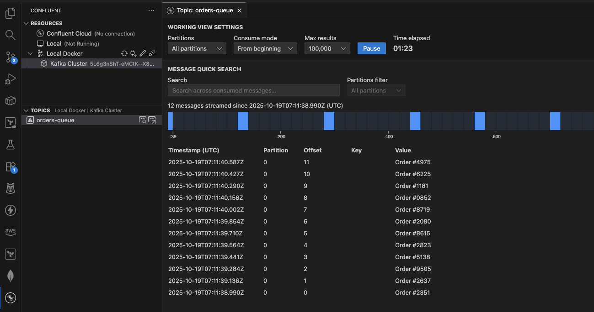

# Queues for Kafka Demo
This is a minimal demo of **Queues for Kafka** (KIP-932), showing how Apache Kafka® can be used in a queue-like fashion where messages are delivered to only one consumer within a shared group. The demo simulates a restaurant scenario:
 - waiters (producers) send orders to the kitchen (Kafka topic `orders-queue`), and
 - multiple chefs (consumers in the same share group `chefs-share-group`) pick up and process orders one by one.  

The demo is based on the following resources:  
- [KIP-932: Queues for Kafka](https://cwiki.apache.org/confluence/display/KAFKA/KIP-932%3A+Queues+for+Kafka)  
- [Morling Dev: KIP-932 Queues for Kafka](https://www.morling.dev/blog/kip-932-queues-for-kafka/)

---

## Dependencies
- [Maven](https://maven.apache.org/install.html)  
- [Java 17](https://www.oracle.com/java/technologies/javase/jdk17-archive-downloads.html)  
- [Docker](https://docs.docker.com/get-docker/)

---

## Setup and Configure Apache Kafka 4.1.0

### Copy Dependencies and Compile the project:
```bash
mvn dependency:copy-dependencies -DoutputDirectory=lib
javac -cp "lib/*" -d bin src/com/example/qtest/*.java
```

Output example:
```bash
[INFO] Scanning for projects...
[INFO] 
[INFO] -------------------------< com.example:qtest >--------------------------
[INFO] Building qtest 1.0-SNAPSHOT
[INFO]   from pom.xml
[INFO] --------------------------------[ jar ]---------------------------------
[INFO] 
[INFO] --- dependency:3.7.0:copy-dependencies (default-cli) @ qtest ---
.
.
.
[INFO] ------------------------------------------------------------------------
[INFO] BUILD SUCCESS
[INFO] ------------------------------------------------------------------------
[INFO] Total time:  3.976 s
[INFO] Finished at: 2025-10-19T07:59:09+01:00
[INFO] ------------------------------------------------------------------------
```

### Pull the Kafka 4.1.0 Docker image:
```bash
docker pull apache/kafka:4.1.0
```

Output example:
```bash
4.1.0: Pulling from apache/kafka
6e174226ea69: Already exists 
65b71ebe70c7: Pull complete 
ffd236ccc425: Pull complete 
4789cfd3eee8: Pull complete 
98e6dc79a227: Pull complete 
cd61f5351b3e: Pull complete 
f750e0a0984e: Pull complete 
6b1f833ff78d: Pull complete 
24d8c1f280e9: Pull complete 
c6c27b7944e0: Pull complete 
700688e2c13a: Pull complete 
Digest: sha256:bff074a5d0051dbc0bbbcd25b045bb1fe84833ec0d3c7c965d1797dd289ec88f
Status: Downloaded newer image for apache/kafka:4.1.0
docker.io/apache/kafka:4.1.0

What's next:
    View a summary of image vulnerabilities and recommendations → docker scout quickview apache/kafka:4.1.0
```

## Running the Demo

### Start Kafka Broker

#### On one terminal, run:
```bash
docker run --rm -p 9092:9092 apache/kafka:4.1.0
```

#### Inside the container, execute the following to enable share groups and create the topic:
```bash
/opt/kafka/bin/kafka-features.sh --bootstrap-server localhost:9092 upgrade --feature share.version=1
/opt/kafka/bin/kafka-topics.sh --bootstrap-server localhost:9092 --create --topic orders-queue --partitions 1
/opt/kafka/bin/kafka-topics.sh --bootstrap-server localhost:9092 --describe --topic orders-queue
```

Note the topic `orders-queue` was created with oen partion only!

Output example:
```bash
share.version was upgraded to 1.

Created topic orders-queue.

Topic: orders-queue     TopicId: 1HHKxeTuTVOFm0ZaI5BHPw PartitionCount: 1     ReplicationFactor: 1    Configs: min.insync.replicas=1,segment.bytes=1073741824
      Topic: orders-queue     Partition: 0    Leader: 1       Replicas: 1     Isr: 1  Elr:    LastKnownElr: 
```

## Run the Producer

### On another terminal, run:
```bash
java -cp "bin:lib/*" com.example.qtest.QProducer
```

Output example:
```bash
╔═══════════════════════════════════════════╗
║         🍽️  StreamBytes Restaurant        ║
╠═══════════════════════════════════════════╣
║  Waiters send orders to the kitchen via   ║
║  Kafka Queues (KIP-932 / Share Groups).   ║
╚═══════════════════════════════════════════╝

🛎️ Press [ENTER] to send a new order ([Ctrl+C] to quit)...
```

## Run the Share Consumers (Chefs)

### Open three separate terminals (one for each chef) and run:
```bash
java -cp "bin:lib/*" com.example.qtest.QTest Chef-1
java -cp "bin:lib/*" com.example.qtest.QTest Chef-2
java -cp "bin:lib/*" com.example.qtest.QTest Chef-3
```

Each chef will receive orders in a queue-style delivery, and you can choose to Accept (A), Release (E), or Reject (R) each order.

Output example for `Chef-1`:
```bash
╔═══════════════════════════════════════════╗
║         🔪  StreamBytes Kitchen           ║
╠═══════════════════════════════════════════╣
║  Chef: Chef-1                             ║
╚═══════════════════════════════════════════╝

Creating KafkaShareConsumer...

✅ Subscribed to topic 'orders-queue' (group='chefs-share-group')

👨🏻‍🍳 Chef-1 listening for new orders...
```

## How it works
The **producer** simulates a waiter sending orders to the kitchen:

- Press **ENTER** to submit a new order. Each order is a simple string, e.g., `Order #4768`, `Order #8563`, etc.
- Orders are sent to the Kafka topic `orders-queue`.
- The **share consumers** (`chefs-share-group`) will receive the orders in a **queue-style delivery**, meaning each order is handled by only one chef at a time.
- When a chef receives an order, they can choose to:
  - **[A]ccept** – the order is processed and acknowledged.
  - **R[e]lease** – the order is returned to the queue to be picked up later. Each order can only be released up to **five times**.
  - **[R]eject** – the order is discarded.

The Kafka topic has **only one partition**, but you can spin up **multiple share consumers** in the same group. The share group ensures **queue-style delivery**, so each message is consumed by **only one consumer at a time** However, message ordering is **not guaranteed**, and messages may be processed out of order if released back to the queue.

This setup lets you see real-time queue behavior in Kafka with multiple consumers sharing work fairly.


## Classic Kafka Consumer vs. Shared Consumers
To see how Queues for Kafka (KIP-932) differs from traditional consumer groups, try running two instances of the ClassicConsumer (on different terminals):
```bash
java -cp "bin:lib/*" com.example.qtest.ClassicConsumer
java -cp "bin:lib/*" com.example.qtest.ClassicConsumer
```

Unlike shared consumers (KafkaShareConsumer), classic Kafka consumers use consumer groups where each partition in a topic is exclusively assigned to one consumer within the group.

Since the demo topic (`orders-queue`) only has one partition, only one consumer in the classic consumer group will be active, all others will remain idle. This behavior contrasts with share groups, where multiple consumers can process messages from the same partition concurrently while Kafka still ensures that each message is delivered to exactly one active consumer.

This comparison clearly shows how KIP-932 introduces true queue semantics on top of Kafka’s strong partitioning model.

## Testing Queues for Kafka via the CLI
You can also test Queues for Kafka (KIP-932) directly from the command line using the built-in Kafka CLI tools, no Java code required.

First, start a producer that sends orders (one per line, press **[ENTER]** to submit each message):
```bash
/opt/kafka/bin/kafka-console-producer.sh --bootstrap-server localhost:9092 --topic orders-queue
```

Then, in three separate terminals, start shared consumers that demonstrate different acknowledgment behaviors. Each consumer belongs to the same share group (`chefs-share-group`), so messages are load-balanced between them:
```bash
# Chef that always ACCEPTS messages
/opt/kafka/bin/kafka-console-share-consumer.sh --bootstrap-server localhost:9092 --topic orders-queue --group chefs-share-group --property print.offset=true --property print.partition=true --property print.timestamp=true

# Chef that always RELEASES messages (sends them back to the queue)
/opt/kafka/bin/kafka-console-share-consumer.sh --bootstrap-server localhost:9092 --topic orders-queue --group chefs-share-group --release --property print.offset=true --property print.partition=true --property print.timestamp=true

# Chef that always REJECTS messages (discards them)
/opt/kafka/bin/kafka-console-share-consumer.sh --bootstrap-server localhost:9092 --topic orders-queue --group chefs-share-group --reject --property print.offset=true --property print.partition=true --property print.timestamp=true
```

This simple setup lets you experiment with shared consumer semantics, observing how acknowledgments (ACCEPT, RELEASE, REJECT) change message flow behavior in real time.

## Inspecting Consumer and Share Groups
Kafka 4.1.0 introduces dedicated tooling to manage and inspect share groups (as part of the new Queues for Kafka feature). You can use the following commands to explore both classic and shared consumer groups on your cluster.
```bash
# List all groups (both classic and share groups)
 /opt/kafka/bin/kafka-groups.sh --bootstrap-server localhost:9092 --list

# List only the share groups
 /opt/kafka/bin/kafka-share-groups.sh --bootstrap-server localhost:9092 --list

# Describe the share group "chefs-share-group"
 /opt/kafka/bin/kafka-share-groups.sh --bootstrap-server localhost:9092 --describe --group chefs-share-group

# Describe the members (active consumers) of "chefs-share-group"
 /opt/kafka/bin/kafka-share-groups.sh --bootstrap-server localhost:9092 --describe --group chefs-share-group --members

# Describe the current state of the share group "chefs-share-group"
 /opt/kafka/bin/kafka-share-groups.sh --bootstrap-server localhost:9092 --describe --group chefs-share-group --state
```

These commands allow you to monitor how share groups are distributed across consumers, verify which instances are active, and inspect the internal state maintained by Kafka for load balancing and message delivery tracking.

## Bonus Section: Visualise your Kafka Data in VS Code
To make the demo even more interactive, you can visualise your Kafka topics and messages directly inside VS Code using the excellent Confluent VS Code extension.



## External References
Check out [Confluent's Developer portal](https://developer.confluent.io), it has free courses, documents, articles, blogs, podcasts and so many more content to get you up and running with a fully managed Apache Kafka service.

Disclaimer: I work for Confluent :wink:

Apache®, Apache Kafka®, Kafka®, Apache Flink®, Flink®, and the associated Flink and Kafka logos are trademarks of Apache Software Foundation.